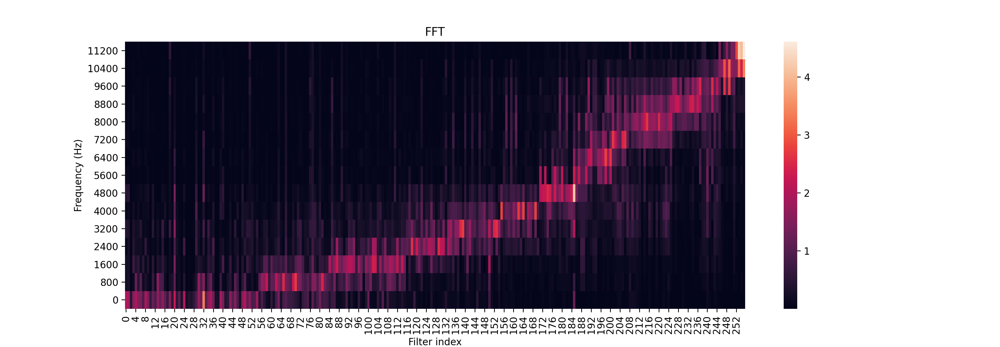

# Conv-TasNet for Basis-MelGAN

Basis-MelGAN: Efficient Neural Vocoder Based on Audio Decomposition. (Accepted by Interspeech 2021)

This repo contains conv-tasnet for basis-melgan. If you want to get code of basis-melgan, please refer [FastVocoder](https://github.com/xcmyz/FastVocoder).

## Abstract

Recent studies have shown that neural vocoders based on generative adversarial network (GAN) can generate audios with high quality. While GAN based neural vocoders have shown to be computationally much more efficient than those based on autoregressive predictions, the real-time generation of the highest quality audio on CPU is still a very challenging task. One major computation of all GAN-based neural vocoders comes from the stacked upsampling layers, which were designed to match the length of the waveform's length of output and temporal resolution. Meanwhile, the computational complexity of upsampling networks is closely correlated with the numbers of samples generated for each window. To reduce the computation of upsampling layers, we propose a new GAN based neural vocoder called Basis-MelGAN where the raw audio samples are decomposed with a learned basis and their associated weights. As the prediction targets of Basis-MelGAN are the weight values associated with each learned basis instead of the raw audio samples, the upsampling layers in Basis-MelGAN can be designed with much simpler networks. Compared with other GAN based neural vocoders, the proposed Basis-MelGAN could produce comparable high-quality audio but significantly reduced computational complexity from HiFi-GAN V1's 17.74 GFLOPs to 7.95 GFLOPs.

## Usage

Based on [BiaoBei dataset](https://www.data-baker.com/#/data/index/source), pretrained model is in [here](), demo is [here](/demo).

### 1. preprocess

Download BiaoBei dataset in `/`, run `python3 preprocess.py`

### 2. train

run `python3 train.py`, pretrained model is trained to 300k steps.

### 3. analysis

run `python3 analysis.py --step <step of checkpoint>`, note:

- `<step>_<num>_est_noi_non_noi.wav`: estimated noise waveform from clean source
- `<step>_<num>_est_noi.wav`: estimated noise waveform from mix source
- `<step>_<num>_est_wav_non_noi.wav`: estimated clean waveform from clean source
- `<step>_<num>_est_wav.wav`: estimated clean waveform from mix source

### 4. generate data for basis-melgan

run `python3 generator.py --step <step of checkpoint>`

## Analysis

    

## Acknowledgements

- [katuoxu: TasNet](https://github.com/kaituoxu/TasNet)
- [kaituoxu: Conv-TasNet](https://github.com/kaituoxu/Conv-TasNet)
